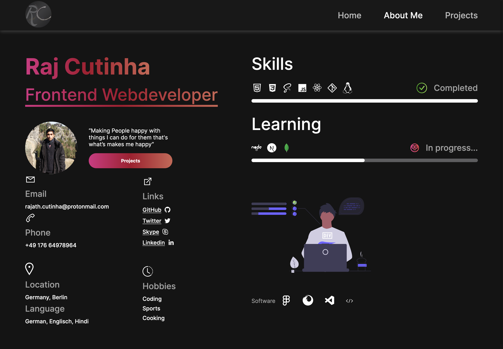

# Raj Cutinha Portfolio

Live Site: https://rajcutinha.netlify.app/

---

---

## About

A simple static Portfolio Site

### Includes

- Intro Section
  - Small intro Sentence
- About Me Section
  - Infos About me
  - Links to Social Media
  - List of Skills
  - Contact Details
- Projects Section
  - A clickable Grid with live Projects

---

## Languages used

&nbsp

&nbsp

